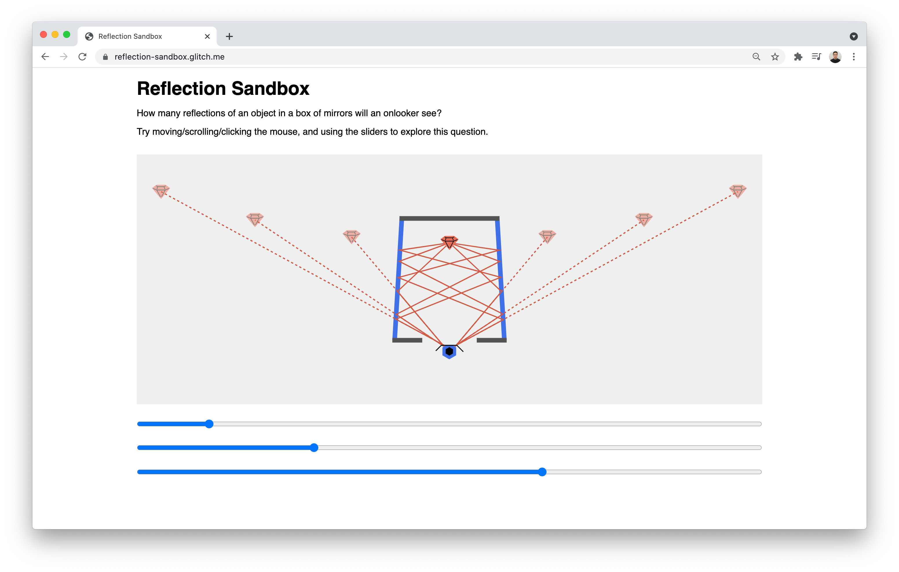

# Reflection Sandbox


## Description
Reflection Sandbox is an interactive app that allows users to explore the question, "how many reflections of an object in a box of mirrors will an onlooker see?".

Here's the [Live Demo on Glitch](https://reflection-sandbox.glitch.me/).

## Setup
1. Installation of node.js is required.
2. Run the following commands in the Terminal.
```
git clone https://github.com/cuinjune/reflection-sandbox.git
cd reflection-sandbox
npm install dependencies
gulp
npm start
```
3. Open your web browser and navigate to http://localhost:8000

## Tools used
HTML, CSS, JavaScript, Node.js, Express.js, gulp.js
